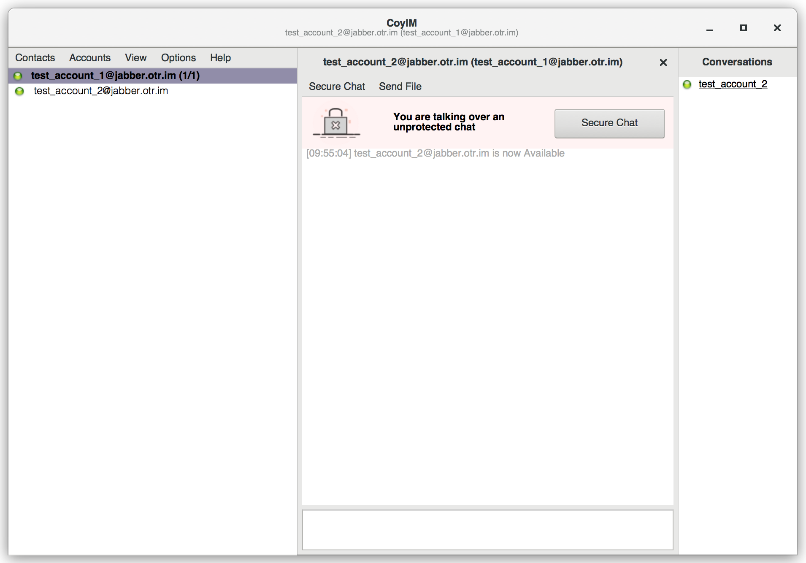

# CoyIM - a safe and secure chat client

[](https://travis-ci.org/coyim/coyim)
[](https://ci.appveyor.com/project/olabini/coyim)
[](https://coveralls.io/github/coyim/coyim?branch=master)
[](https://bintray.com/coyim/coyim-bin/coyim-bin/_latestVersion#files)

<p align="center">
  
</p>

CoyIM is a new client for the XMPP protocol. It is built upon
https://github.com/agl/xmpp-client and https://github.com/coyim/otr3. It adds a
graphical user interface and implies safe and secure options by default. Our
ambition is that it should be possible for even the most high-risk people on the
planet to safely use CoyIM, without having to make any configuration changes.

To do this, CoyIM has OTR enabled and uses Tor by default. Besides that, it will
only use the Tor Onion Service for a known server and also uses TLS and TLS
certificates to verify the connection - no configuration required. The
implementation is written in the Go language, to avoid many common types of
vulnerabilities that come from using unsafe languages.

## Security warning

CoyIM is currently under active development. There have been no security audits
of the code, and you should currently not use this for anything sensitive.

## Getting started

Using CoyIM is very simple: you just need to download the executable file from
the project's [home page](https://coy.im/) and then run it.

When you first launch CoyIM, a wizard will appear. If you already have a Jabber
client installed and configured for OTR encryption in your computer, you can use
this wizard to import your account settings as well as your OTR keys, and your
contacts' fingerprints. By importing them, you won't have to do anything else to
use CoyIM just as you used your former client.

If you don't import your account settings, keys and fingerprints through the
wizard that opens at the first launch, you can still import them by going to
Accounts -> Import at a later stage.

<p align="left">
  
</p>

If the client you have been using so far is Pidgin, you will find the files you
need to import in the `.purple` directory in your home.

If you want to know more about the features you will and will not find in CoyIM,
read [this page](https://coy.im/what-is-coyim/).

<p align="left">
  
</p>

## Building CoyIM

**Please note**: Important requirements for building CoyIM are also git and
golang (at least version 1.11).

The GUI version requires GTK+ >= 3.6.16, which installation depends on your OS:

**Ubuntu:**

```sh
sudo apt-get install gtk+3.0 libgtk-3-dev
```

**MacOS:**

```sh
brew install gnome-icon-theme
brew install gtk+3 gtk-mac-integration
```

Then install CoyIM:

```sh
export GTK_VERSION=$(pkg-config --modversion gtk+-3.0 | tr . _ | cut -d '_' -f 1-2)
go get -u -tags "gtk_${GTK_VERSION}" github.com/coyim/coyim
```

## Contributing to CoyIM

We have instructions to help
you [get started contributing to CoyIM](CONTRIBUTING.md).

## Reproducibility

CoyIM supports reproducible builds for Linux on AMD64.
See [REPRODUCIBILITY](REPRODUCIBILITY.md) for instructions on how to build or
verify these builds.
